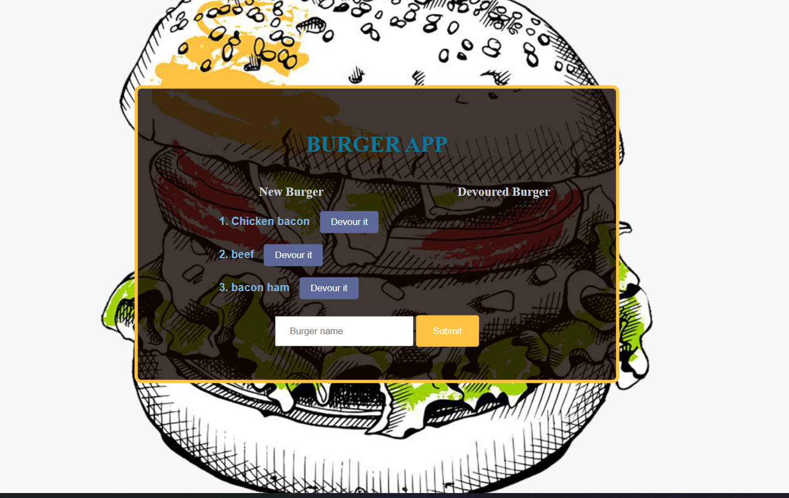

# Burger_app

1.[Description](#Description)

2.[Installation ](#Installation )

3.[How to use](#How-to-use)

4.[Technologies Used](#Technologies-Used)

# Description
This is an app for listing the burgers a user will like to eat 

# Installation 
This app can be run on your local computer clone the repository then in your terminal run `npm i` to install the dependencies the run `nodemon server.js` to run the application

It was also deployed on heroku so here is the link
[Burger App](https://calm-plains-16763.herokuapp.com/)

# How to use
In the text area write the name of the burger you want then click submit. The burger is created and put in the new burger section. When the devour it button is clicked the burger is then moved to the devoured burger section.

# Technologies Used
Model view controller (MVC) design

Front end:HTML, CSS, JavaScript.

Back end: Node js, Express js, Express handlebars, MySql, Object relation mapping (ORM).

Enjoy this app.